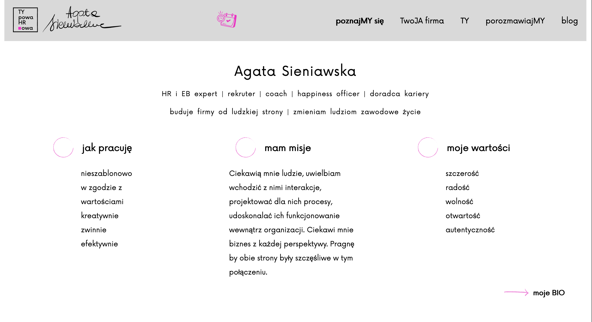

# Typowa HRowa - Portfolio Website

## Demo
🌐 [Live Demo](https://j-a-r-e-k.github.io/typowaHRowa/)

## English Description 🇬🇧

A website showcasing the activities of Typowa HRowa - Agata Sieniawska. Presents her professional experience, completed projects, and offers for different client groups. The site provides direct contact options and access to social media.

## Features
- Home page with professional presentation of Agata Sieniawska
- Detailed description of HR services offered
- Client cooperation pathway presentation
- Contact form link for scheduling meetings
- Social media integration
- Portfolio of completed projects
- Responsive interface optimized for all devices
- Blog with HR-related articles

## Project Structure
- `index.html`: Main HTML file with site structure
- `js/`: JavaScript files directory
 - `nav.js`: Navigation handling
 - `offer.js`: Offers handling
 - `bio.js`: Biography handling
 - `scrolled.js`: Carousel handling
- `sass/`: Styles directory
 - `_typowaHR.scss`: Main styles file
 - `_aboutMe.scss`: About section styles
 - `_blog.scss`: Blog section styles
 - `_cooperation.scss`: Cooperation section styles
 - `_recruitment.scss`: Recruitment section styles
 - `_you.scss`: Client section styles

## Technologies Used
- HTML5 - site structure
- SASS - advanced CSS styling
- JavaScript - site interactivity
- Git - version control system

## Polski Opis 🇵🇱
Strona internetowa przedstawiająca działalność Typowej HRowej - Agaty Sieniawskiej. Prezentuje jej doświadczenie zawodowe, realizowane projekty oraz oferty dla różnych grup klientów. Strona umożliwia bezpośredni kontakt oraz dostęp do mediów społecznościowych.

## Funkcjonalności
- Strona główna z profesjonalną prezentacją Agaty Sieniawskiej
- Szczegółowy opis oferowanych usług HR
- Prezentacja ścieżki współpracy dla klientów
- Łącze formularza kontaktowego do umówienia spotkań
- Integracja z mediami społecznościowymi
- Portfolio zrealizowanych projektów
- Responsywny interfejs dostosowany do wszystkich urządzeń
- Blog z artykułami o tematyce HR

## Struktura projektu
- `index.html`: Główny plik HTML z strukturą strony
- `js/`: Katalog zawierający pliki JavaScript
  - `nav`: Obsługa nawigacji  
  - `offer`: Obsługa ofert  
  - `bio`: Obsługa bio  
   - `scrolled`: Obsługa karuzeli
- `sass/`: Katalog ze stylami
  - `_typowaHR.scss`: Główny plik stylów
  - `_aboutMe.scss`
  - `_blog.scss`
  - `_cooperation.scss`
  - `_recruitment.scss`
  - `_you.scss`

## Zastosowane technologie
- HTML5 - struktura strony
- SASS - zaawansowane style CSS
- JavaScript - interaktywność strony
- Git - system kontroli wersji